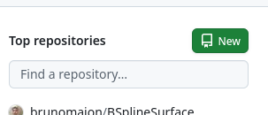
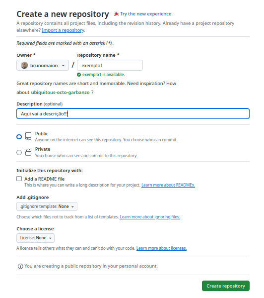
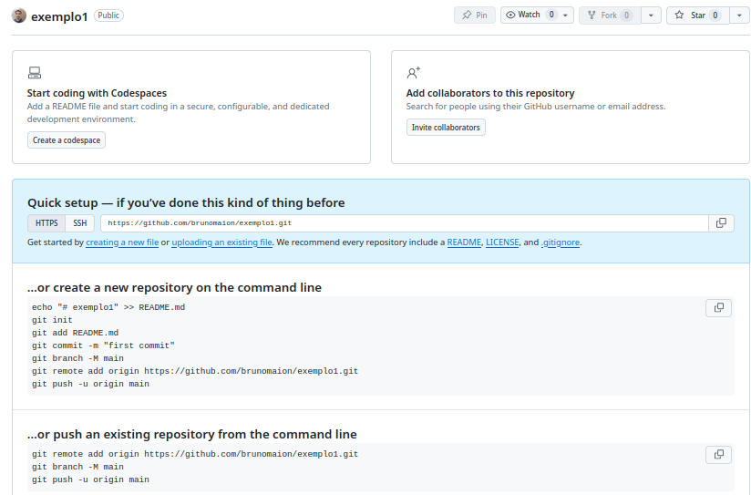
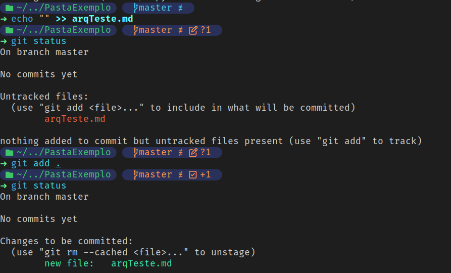
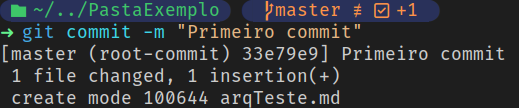
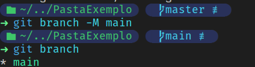
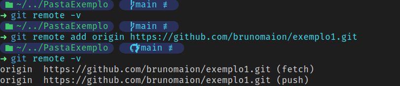
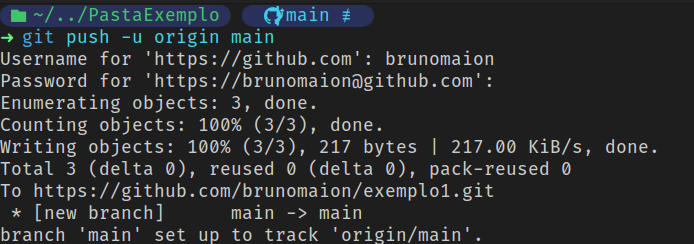

# Git e Github

- O que é o git?

    O **Git** é um sistema de **controle de versão** de código aberto (*open source*), usado para gerenciar alterações em arquivos ao longo do tempo. Ele é muito utilizado no desenvolvimento de software, permitindo que várias pessoas trabalhem juntas no mesmo projeto sem perder o histórico das mudanças.

- Mas o que é um sistema de versionamento de código?

    É um sistema que serve para **gerenciar diferentes versões** de arquivos ou documentos. Utilizado para obter maior controle sobre o processo de desenvolvimento, permitindo também o desenvolvimento em paralelo (mais de 1 programador). Permitindo:

    - Controlar o histórico de alterações do código-fonte.

    - Permitir a recuperação de versões anteriores.

    - Facilitar o desenvolvimento em **paralelo** (várias pessoas editando sem conflito permanente).

    - Garantir maior **organização e segurança** no processo de desenvolvimento.


- Qual a importância de usar um sistema de versionamento de código?

  - **Histórico seguro**: todo o progresso é registrado.

  - **Colaboração**: vários desenvolvedores podem trabalhar no mesmo projeto.
  - **Rastreamento de erros**: é possível voltar a uma versão estável se surgir um problema.

  - **Organização**: facilita a criação de diferentes ramificações (*branches*) para desenvolver novas funcionalidades sem quebrar o projeto principal.

- E o GitHub?

    Funciona como um **"Google Drive dos códigos"**, mas com ferramentas próprias para programadores.

    Permite armazenar, compartilhar e colaborar em projetos.

    Também funciona como uma **rede social de desenvolvedores**, onde é possível:

    - Contribuir em projetos abertos.
    - Publicar seus próprios repositórios.
    - Interagir com outros programadores.


## Termos

- **repo/repository**: local onde fica os arquivos; diretório.
- **commit**: coleção de alterações no código.
- **branch**: em PT-BR, ramificação!! A principal se chama **master** ou **main**


## 1. Instalando e configurando

Ubuntu/Debian
```.sh
sudo apt-get install git
```

Windows
```.sh
https://git-scm.com/downloads/win
```


### **Após a instalação**

Para utilizar o **Git** no:

- Linux: Basta abrir o terminal.

- Windows: Abra o programa **Git Bash**,


### Configurando

Adicione seu nome de usuário e senha, utilize o mesmo de seu GitHub

```.sh
git config --global user.name "Nome"
```

```.sh
git config --global user.email "nome@email.com"
```

Para conferir:
```.sh
git config --list
```


## 2. Criando Token Github

**ATENÇÃO !!** - O token só é necessário utilizando Linux, no Windows quando você faz o primeiro "push" ele autentifica pelo login no seu navegador. 

Após criar sua conta, você precisará de um token de acesso.

- Basta ir em Settings > Developer Settings > Tokens > Generate new token
    - Você pode definir uma data de validade
    - SALVE em algum lugar !! Você não conseguirá consultar este token novamente


## 3. Criando um repositório remoto no GitHub

Vá em novo:



Os repositórios podem ser públicos ou privados (estes, há limite de armazenamento por usuário)




Pronto!!



Dica: salve os comando abaixo, principalmente o
```.sh
git remote add origin https://github.com/brunomaion/exemplo1.git
```


## 4. Iniciando seu repositório

Em sua máquina local, escolha um diretório de trabalho, conhecido como workspace....

- Dica para linux: Criando pasta com mkdir
```
mkdir ~/Desktop/PastaExemplo
```

Inicie o git em seu diretório com o comando
```.sh
git init
```

Deve retornar a seguinte mensagem:
```
Initialized empty Git repository in /home/bruno/Desktop/PastaExemplo/.git/
```

Com este comando, foi criado a pasta ".git" uma pasta invsível que contém todas as infromações necessárias para que o git funcione.

- Se ainda estiver em dúvida dê "ls -la" 


## 5. Status e Commits

Crie um arquivo qualque em seu diretório
```.sh
echo "oi!!" >> arqTeste.md
```
Ao criar arquivos novos eles recebem o status de "Untracked", ou seja, não estão sendo monitorados pelo git. Para verificar os status dos arquivos, utilize o comando:

```.sh
git status
```

Para "rastrear" os arquivos você deve adicionar com o comando:
```.sh
git add exemplo.txt
```
Ou para adicionar TODOS de uma vez:
```.sh
git add .
```


Exemplo:




Agora adiconado, você já pode commitar as alterações.

```.sh
git commit -m "Primeiro commit!"
```



## 6. master -> main

Por preferência, altere o nome da sua **branch** principal para main

```.sh
git branch -M main
```

Para verificar em qual branch você está trabalhando, utilize o comando 
```.sh
git branch
```


## 7. Sincronização

Consulte se há um repositório remoto já definido

```.sh
git remote -v
```

Para adicionar um repositório:

```.sh
git remote add origin https://github.com/brunomaion/exemplo1.git
```



Caso precise alterar o repositório remoto:
Remova com:
```.sh
git remote remove <NOME_LISTADO>
```

### 8. Upload

Para upload, utilize o comando:
```.sh
git push -u origin main
```



### CONCLUSÃO

Em primeiro contato pode parecer assustador e complicado, mas tente lembrar que Git e GitHub são coisas distintas.

Para lembrar do passo a passo não precisa decorar (google existe pra isso!). Lembre-se em resumo:
- 1. Crie o repo remoto 
- 2. Inicie o git
- 3. Adicione os arquivos e faça o commit (COMMITAR!!)
- 4. Mude o nome da brainch para main
- 5. Adicione o repo remoto ao seu repo local e empurre (PUSH!!!)

Para futuras alterações:
- 1. commit !!
- 2. push !!


## Outros

### clonar repositório

Para clonar um repositório remoto

```.sh
git clone <link>
```

### .gitignore

O arquivo .gitignore serve para que o git literalmente ignore os arquivos listados que foram declarados.

Por exemplo: arquivos com senhas ou dados sensíveis que estão no diretório englobado pelo git mas não devem ser acessados por ele.

